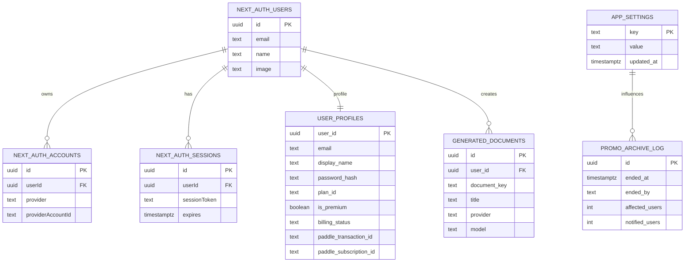
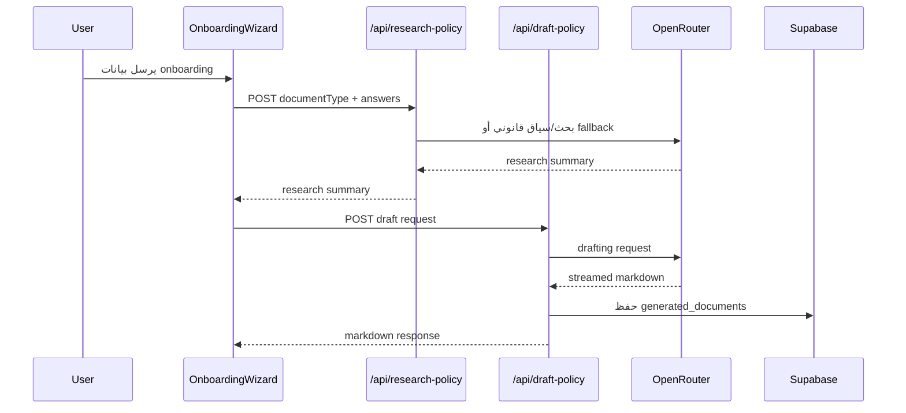
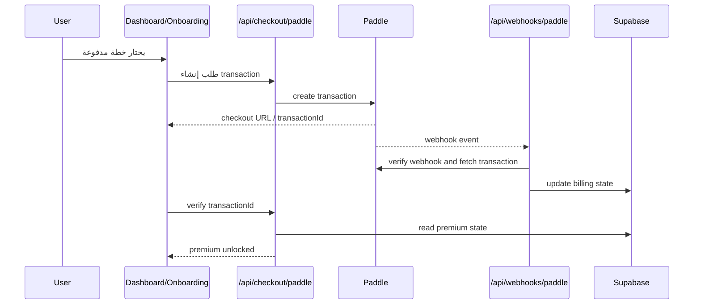

# تقرير التحليل الشامل لمشروع PolicyPack

تاريخ التحليل: 2026-04-16

## 1. الملخص التنفيذي

### نظرة عامة
`PolicyPack` هو تطبيق SaaS مبني على `Next.js App Router` لتوليد صفحات ووثائق قانونية مخصصة للشركات الرقمية ومنتجات SaaS باستخدام الذكاء الاصطناعي. يجمع المشروع بين:

- واجهة أمامية تفاعلية بـ `React 19`
- طبقة خادم مدمجة عبر `Next.js Route Handlers`
- مصادقة عبر `NextAuth v5 beta` و`Supabase`
- دفع عبر `Paddle`
- إشعارات بريدية عبر `Nodemailer`
- توليد قانوني عبر `OpenRouter`
- تخزين مستندات وبيانات المستخدم في `PostgreSQL/Supabase`

### النتائج الرئيسية

#### نقاط القوة
- بنية مشروع واضحة نسبيًا، مع فصل جيد بين `app` و`components` و`lib`.
- نجاح `lint` و`typecheck` وجميع الاختبارات الحالية.
- وجود مسارات API مهمة ومحمية جيدًا نسبيًا للمصادقة والإدارة والدفع.
- وجود طبقات fallback مفيدة عند غياب تكوين `Supabase` أو `OpenRouter`.
- دعم واضح لتتبع الدفع والتحقق من عمليات `Paddle` قبل منح الوصول المدفوع.
- تفعيل `RLS` على الجداول الحساسة في قاعدة البيانات.

#### نقاط الضعف
- كانت هناك فجوة سابقة في ملف `.env.example` وتوثيق البيئة، وتم استكمالها لاحقًا بإضافة/توسيع الملف وتحديث `README.md`.
- توجد مشكلات ترميز نصي `mojibake` داخل بعض الملفات والتعليقات وسلاسل prompts.
- تغطية الاختبارات متوسطة فقط، خاصة في الفروع `Branches`.
- الاعتماد على `next-auth` بإصدار `beta` يضيف مخاطرة تشغيلية.
- محدد السرعة `rate-limit` معتمد على الذاكرة المحلية فقط وغير مناسب للتوسع الأفقي.
- محرك التدقيق `audit-engine` قائم على قواعد ثابتة، وبعض قواعده لا تتوافق مع قيم الواجهة الحالية.

#### المخاطر
- مخاطر إعداد وتشغيل أولي انخفضت بعد استكمال ملف البيئة المثال، لكن ما يزال نجاح التشغيل مرتبطًا بصحة مفاتيح `Supabase` و`Paddle` و`OpenRouter` و`SMTP`.
- مخاطر جودة مخرجات الذكاء الاصطناعي بسبب فساد بعض النصوص المستخدمة في prompts.
- مخاطر أمنية منخفضة إلى متوسطة بسبب ثغرة تبعية غير مباشرة (`hono`).
- مخاطر سلوكية في ميزات التدقيق compliance لأن بعض القواعد لا يتم تفعيلها كما هو متوقع.

### التوصيات العاجلة
1. تم التنفيذ: استكمال ملف `.env.example` وتوثيق جميع المتغيرات المطلوبة في `README.md`.
2. تنظيف كل النصوص المتضررة من مشاكل الترميز في `policy-generator.ts` و`onboarding-wizard.tsx` وملفات أخرى مشابهة.
3. إصلاح منطق `audit-engine` ليتوافق مع قيم `aiTransparencyLevel` الفعلية.
4. رفع تغطية الاختبارات لمسارات المصادقة والإدارة والتدقيق وقاعدة البيانات.
5. استبدال محدد السرعة المحلي بآلية موزعة مثل `Redis/Upstash` في بيئة الإنتاج.

## 2. بنية المشروع

### المجلدات الرئيسية
- `src/app`: صفحات الواجهة ومسارات API ضمن App Router.
- `src/components`: مكونات الواجهة، مقسمة إلى أقسام مثل `auth`, `dashboard`, `billing`, `layout`, `legal`, `settings`, `admin`.
- `src/lib`: منطق الأعمال الأساسي مثل المصادقة، الدفع، الذكاء الاصطناعي، التدقيق، التخزين المحلي.
- `supabase`: مخطط قاعدة البيانات وملفات الترحيل.
- `scripts`: سكربتات مساعدة، أبرزها توليد صفحات الموقع القانونية الثابتة.
- `.github/workflows`: خط CI/CD.
- `public`: الأيقونات والملفات العامة.
- `ملفات_النصوص`: تقارير ووثائق تحليلية سابقة.

### الملفات المرجعية الأساسية

#### `README.md`
- يشرح فكرة المشروع والتقنيات الأساسية والتشغيل المحلي.
- يذكر تشغيل `docker-compose.yml` لقاعدة PostgreSQL المحلية.
- يذكر نسخ `.env.example` إلى `.env.local`، لكن الملف غير موجود فعليًا.

#### `package.json`
- يعتمد على `Next.js 16`, `React 19`, `Tailwind CSS v4`, `NextAuth v5 beta`, `Supabase`, `Paddle`, `OpenRouter`.
- السكربتات الأساسية:
  - `dev`
  - `build`
  - `start`
  - `lint`
  - `typecheck`
  - `test`
  - `test:coverage`
  - `regen:site-legal`
- يفرض `Node >=24`.

#### `docker-compose.yml`
- يوفّر PostgreSQL محليًا عبر `postgres:15-alpine`.
- يربط `supabase/schema.sql` بمرحلة التهيئة.
- مناسب للتطوير المحلي، لكن ليس لتشغيل إنتاجي.

#### `eslint.config.mjs`
- يعتمد على إعدادات `Next.js core-web-vitals` و`typescript`.
- لا توجد تخصيصات إضافية قوية عدا ضبط الـ ignore.

#### `vitest.config.ts`
- يستخدم `jsdom`.
- مهيأ لاختبارات وحدات وRoute handlers.

#### `next.config.ts`
- شبه فارغ، ما يعني عدم وجود تخصيصات أداء أو صور أو headers أو redirects على مستوى Next config.

#### `.github/workflows/ci.yml`
- يشغّل `npm ci --legacy-peer-deps`
- يمر على:
  - `npm run lint`
  - `npm run typecheck`
  - `npm run test`
- النشر الفعلي مفوض إلى `Vercel`.

## 3. الطبقات البرمجية

### 3.1 الواجهة الأمامية Frontend

#### الصفحات الرئيسية
- الصفحة الرئيسية `src/app/page.tsx`
  - تعرض الأقسام التسويقية: `Hero`, `Features`, `Pricing`, `FAQ`, `LaunchRisk`.
- صفحة `dashboard`
  - تعرض حالة المستندات والمراجعة والتصدير والتدقيق والدفع.
- صفحة `onboarding`
  - تجمع بيانات العمل والمناطق والبيانات المجمعة والمزودين وصفحات الموقع المطلوبة.
- صفحات قانونية ثابتة مثل:
  - `privacy`
  - `terms`
  - `refund-policy`
  - `cookie-policy`
  - `privacy-policy`
  - `terms-of-service`
  - `about-us`
  - `contact-us`
  - `legal-disclaimer`
- صفحة الإدارة:
  - `admin/users`
- صفحة الإعدادات:
  - `dashboard/settings`

#### المكونات البارزة
- `OnboardingWizard`
  - معالج أسئلة متعدد الخطوات.
  - يحدد الصفحات المسموح بها حسب الخطة.
  - يدير الدفع وبدء التوليد وحفظ المسودة محليًا.
- `ComplianceDashboard`
  - يدير عرض المستندات، الحفظ، التدقيق، الدفع، والتصدير PDF.
- `AccountSettingsPanel`
  - تحديث الاسم، كلمة المرور، وحذف الحساب.
- `AdminUsersPanel`
  - إدارة المستخدمين وإنهاء/استرجاع العرض الترويجي.
- `LegalDocumentRenderer`
  - يحول Markdown إلى HTML بشكل آمن نسبيًا.

### 3.2 الواجهة الخلفية Backend / API

المشروع يستخدم `Route Handlers` داخل `src/app/api` بدل خادم منفصل.

#### مسارات المصادقة والحساب
- `POST /api/auth/register`
  - إنشاء حساب بريد/كلمة مرور.
  - يتحقق من صحة البيانات ويستخدم `bcryptjs`.
  - عليه محدد سرعة بسيط.
- `PATCH /api/account/profile`
  - تحديث اسم العرض.
- `PATCH /api/account/password`
  - تغيير كلمة المرور مع تحقق زمني محدود.
- `DELETE /api/account`
  - حذف الحساب.

#### مسارات التوليد القانوني
- `POST /api/research-policy`
  - يجلب أو يبني سياق قانوني للوثيقة.
  - يستخدم `OpenRouter` إذا توفر المفتاح.
  - وإلا يعود إلى سياق ثابت enriched fallback.
- `POST /api/draft-policy`
  - ينشئ الوثيقة بصيغة Markdown.
  - يدعم البث streaming.
  - يحفظ الناتج في قاعدة البيانات عند اكتمال التوليد.
- `POST /api/render-policy-html`
  - يحول Markdown إلى HTML مهيأ للطباعة.

#### مسارات الدفع
- `GET /api/checkout/paddle/client-token`
  - يجهز توكن Paddle.js.
- `POST /api/checkout/paddle`
  - يبدأ المعاملة أو يتحقق من حالة معاملة موجودة.
  - يتحقق من ملكية transaction للمستخدم.
  - يحدّث حالة الاشتراك ويرسل إشعارات.
- `POST /api/webhooks/paddle`
  - يتحقق من توقيع `Paddle`.
  - يتعامل مع:
    - `transaction.*`
    - `subscription.*`
    - `adjustment.*`
  - يطابق المعاملة بالمستخدم عبر `userId` أو البريد أو مراجع الفوترة.

#### مسارات الإدارة
- `GET /api/admin/users`
  - يجلب قائمة المستخدمين.
- `DELETE /api/admin/users/[userId]`
  - حذف مستخدم مع تحقق إضافي.
- `GET /api/admin/promo/status`
  - حالة العرض الترويجي وآخر أرشيف.
- `POST /api/admin/promo/end`
  - إنهاء العرض الترويجي وإخطار المستخدمين.
- `POST /api/admin/promo/rollback`
  - إعادة تفعيل العرض خلال نافذة 24 ساعة.

#### مسارات الصحة والمطور
- `GET /api/health/notifications`
  - فحص اتصال SMTP.
- `POST /api/dev/send-test-email`
  - مسار تطويري لإرسال بريد اختبار، معطل فقط في `production`.

### 3.3 قاعدة البيانات

يعتمد المشروع على `Supabase/PostgreSQL`.

#### الجداول الرئيسية
- `next_auth.users`
- `next_auth.accounts`
- `next_auth.sessions`
- `next_auth.verification_tokens`
- `public.user_profiles`
- `public.generated_documents`
- `public.app_settings`
- `public.promo_archive_log`

#### ملاحظات مهمة
- `user_profiles` يخزن:
  - البريد
  - اسم العرض
  - صورة الحساب
  - كلمة المرور المشفرة
  - الخطة
  - حالة premium
  - بيانات Paddle
- `generated_documents` يخزن الوثائق المولدة لكل مستخدم ولكل نوع وثيقة.
- `app_settings` يستخدم لتفعيل أو إيقاف `promo_active`.
- `promo_archive_log` يسجل عمليات إنهاء/استرجاع العرض الترويجي.
- تم تفعيل `RLS` على الجداول الحساسة، لكن الاعتماد الأساسي فعليًا على `service role key` في الخادم.

## 4. الأهداف الوظيفية وغير الوظيفية

### 4.1 الأهداف الوظيفية
- إنشاء حسابات للمستخدمين عبر:
  - بريد وكلمة مرور
  - Google OAuth
- جمع بيانات نشاط المستخدم عبر `onboarding`.
- تحديد الصفحات القانونية المطلوبة حسب الخطة.
- توليد صفحات قانونية مخصصة بحسب:
  - طبيعة المنتج
  - مناطق العملاء
  - البيانات المجمعة
  - الدفع
  - مقدمي الخدمات الخارجيين
  - مستوى شفافية استخدام الذكاء الاصطناعي
- تخزين الوثائق وعرضها داخل لوحة تحكم.
- تصدير الوثائق كـ PDF/HTML للطباعة.
- إدارة الاشتراكات والتحقق من الدفع عبر Paddle.
- إدارة المستخدمين والعرض الترويجي من لوحة الإدارة.
- إرسال رسائل بريدية إدارية ورسائل ترحيب وإيصالات دفع.

### 4.2 الأهداف غير الوظيفية
- الأمان:
  - التحقق من الجلسات.
  - قوائم سماح للإدارة.
  - التحقق من webhook signatures.
  - تشفير كلمات المرور.
- الاعتمادية:
  - وجود fallbacks عند غياب مفاتيح OpenRouter أو Supabase.
- القابلية للصيانة:
  - منطق الأعمال داخل `lib`.
  - اختبار عدد من المسارات الحساسة.
- الأداء:
  - استخدام `streaming` عند التوليد.
  - `maxDuration` مضبوط لمسارات الذكاء الاصطناعي.
- قابلية التوسع:
  - محدودة حاليًا في بعض النقاط مثل rate limiting المحلي.

## 5. التبعيات الخارجية والحالة الأمنية

### 5.1 التبعيات المباشرة الرئيسية
- `next`: `^16.2.3`
- `react`: `19.2.4`
- `react-dom`: `19.2.4`
- `next-auth`: `^5.0.0-beta.30` مع نسخة مثبتة حالية ظهرت كـ `5.0.0-beta.31`
- `@supabase/supabase-js`: `^2.103.0`
- `@auth/supabase-adapter`: `^1.11.1`
- `@paddle/paddle-js`: `^1.6.2`
- `@paddle/paddle-node-sdk`: `^3.6.1`
- `ai`: `^6.0.159`
- `nodemailer`: `^8.0.5`
- `marked`: `^18.0.0`
- `isomorphic-dompurify`: `^3.8.0`
- `zod`: `^4.3.6`
- `vitest`: `^4.1.4`
- `eslint`: `^9`
- `typescript`: `^5`

### 5.2 نتائج `npm audit`
تم تشغيل `npm audit --json` وكانت النتيجة:

- عدد الثغرات: `1`
- الدرجة: `moderate`
- المكتبة: `hono`
- النوع: `Improperly Handles JSX Attribute Names Allows HTML Injection in hono/jsx SSR`
- المدى المتأثر: `<4.12.14`
- التبعية: غير مباشرة `transitive`
- حالة الإصلاح: `fixAvailable: true`

### 5.3 الحزم المتأخرة `npm outdated`
أبرز الحزم التي لها تحديثات متاحة:

- `next`: `16.2.3 -> 16.2.4`
- `eslint-config-next`: `16.2.3 -> 16.2.4`
- `@paddle/paddle-node-sdk`: `3.6.1 -> 3.7.0`
- `@supabase/supabase-js`: `2.103.0 -> 2.103.2`
- `ai`: `6.0.159 -> 6.0.164`
- `isomorphic-dompurify`: `3.8.0 -> 3.9.0`
- `lucide-react`: `1.7.0 -> 1.8.0`
- `react`: `19.2.4 -> 19.2.5`
- `react-dom`: `19.2.4 -> 19.2.5`

### 5.4 تقييم أمني عام

#### جيد
- تشفير كلمات المرور عبر `bcryptjs`.
- تحقق من `paddle-signature`.
- مسارات الإدارة محمية عبر `session + allowlist`.
- تعقيم HTML المولد باستخدام `DOMPurify`.

#### يحتاج انتباه
- `rate-limit` معتمد على الذاكرة المحلية فقط.
- مسار `dev/send-test-email` آمن فقط إذا كانت بيئة الإنتاج مضبوطة بدقة.
- استخدام `service role key` في الخادم يعني أن أي خلل في حماية المسارات سيؤثر مباشرة على البيانات.
- الاعتماد على نسخة `beta` من `NextAuth` يرفع احتمالية تغييرات غير مستقرة.

## 6. مراجعة جودة الكود

### 6.1 التسمية والتنظيم
- التسمية جيدة عمومًا في `lib` و`api`.
- أسماء الدوال واضحة مثل:
  - `getAppUserProfileById`
  - `setUserBillingState`
  - `runDraftingStage`
  - `buildBillingUpdateFromTransaction`
- التنظيم جيد، لكن بعض المكونات كبيرة جدًا وتحتاج تقسيمًا.

### 6.2 التعليقات
- توجد تعليقات مفيدة في بعض الأماكن.
- توجد أيضًا تعليقات متضررة بسبب الترميز.
- بعض التعليقات تشرح النية التشغيلية جيدًا، مثل مسارات الحماية وقيود بيئة الإنتاج.

### 6.3 ESLint/TypeScript
- `npm run lint`: ناجح
- `npm run typecheck`: ناجح
- هذا مؤشر جيد على الانضباط الأساسي للكود.

### 6.4 الاختبارات
- الإطار المستخدم: `Vitest`
- النتيجة الحالية:
  - `6` ملفات اختبار
  - `29` اختبارًا
  - جميعها ناجحة

### 6.5 تغطية الاختبارات

نتيجة `npm run test -- --coverage`:

- `Statements`: `63.93%`
- `Branches`: `48.19%`
- `Functions`: `67.69%`
- `Lines`: `64%`

#### استنتاج
- التغطية مقبولة كبداية لكنها ليست كافية للمسارات الحرجة.
- التغطية الأفضل تتركز في:
  - مسارات Paddle
  - أجزاء من `policy-engine`
- التغطية الأضعف في:
  - `auth-env.ts`
  - `site-config.ts`
  - فروع منطقية متعددة في مسارات الدفع والويب هوكس

## 7. المشكلات والتحديات التقنية المرصودة

### 7.1 مشكلة إعداد عالية الأولوية
#### غياب `.env.example`
- `README.md` يطلب تنفيذ:
  - `cp .env.example .env.local`
- لكن لا يوجد أي ملف `.env.example` داخل المشروع.
- الأثر:
  - تعطيل سهولة الإعداد الأولي
  - زيادة احتمالات نسيان مفاتيح أساسية
  - رفع وقت onboarding للمطورين الجدد

### 7.2 مشكلة جودة نصية/ترميز
توجد مؤشرات واضحة على فساد ترميز النصوص `mojibake` في عدة مواضع، منها:

- سلاسل prompts داخل `policy-generator.ts`
- تعليقات في `onboarding-wizard.tsx`
- تعليقات في `compliance-dashboard.tsx`
- شروح في `launch-campaign.ts`

الأثر المحتمل:
- تدهور جودة prompts المرسلة إلى النماذج
- ظهور نصوص غير نظيفة في المخرجات
- صعوبة الصيانة والمراجعة

### 7.3 مشكلة منطقية في محرك التدقيق
`audit-engine.ts` يحتوي شرطًا:

- `["Heavy", "Light"].includes(s.answers.aiTransparencyLevel ?? "")`

لكن قيم الواجهة الفعلية هي:

- `Named Providers`
- `Professional/Generic`

الأثر:
- قاعدة `AI Transparency Act` لا تُفعّل عمليًا كما هو متوقع.
- نتائج التدقيق قد تكون ناقصة أو مضللة.

### 7.4 فجوة بين الخطاب التسويقي ومنطق التدقيق
- واجهة `dashboard` تستخدم عبارات مثل "Scanning regulations" و"Audit complete".
- لكن `runAuditEngine()` يعتمد على مصفوفة قواعد ثابتة داخل الكود، وليس على بحث قانوني حي أو مزامنة حقيقية.

الأثر:
- خطر تضخيم قدرات النظام أمام المستخدم.
- قد يسبب توقعات أعلى من السلوك الفعلي.

### 7.5 محدد السرعة غير مناسب للإنتاج
- `rate-limit.ts` يستخدم `Map` داخل الذاكرة فقط.
- لا يعمل بشكل موحد عند:
  - تعدد الحاويات
  - serverless scaling
  - تعدد الـ instances

الأثر:
- يمكن التحايل عليه في البيئات الموزعة.
- غير كافٍ لمسارات حساسة مثل التسجيل وتغيير كلمة المرور.

### 7.6 تضخم بعض المكونات
- `OnboardingWizard` و`ComplianceDashboard` كبيران جدًا ويجمعان:
  - منطق واجهة
  - إدارة حالة
  - استدعاءات API
  - تدفقات دفع
  - منطق حفظ محلي

الأثر:
- صعوبة الاختبار
- صعوبة إعادة الاستخدام
- ارتفاع تكلفة الصيانة

### 7.7 اعتماد تشغيلي على إعداد Supabase خاص
- المشروع يتطلب الوصول إلى schema باسم `next_auth`.
- هناك اعتماد واضح على تمكين هذا الـ schema في إعدادات Supabase Data API.

الأثر:
- قابلية عالية لفشل الإعداد في البيئات الجديدة.
- يحتاج توثيقًا أوضح جدًا.

### 7.8 تعدد إنشاء SMTP transporter
- `notifications.ts` ينشئ `transporter` جديدًا في عدة دوال.
- ليس خطأ مباشرًا، لكنه قابل للتحسين.

الأثر:
- تكرار
- صعوبة ضبط retries أو pooling مركزيًا

## 8. تقييم كل وحدة رئيسية

### 8.1 المصادقة `auth.ts`, `auth-data.ts`, `auth-env.ts`
#### نقاط قوة
- دعم Credentials وGoogle.
- مزامنة `user_profiles` مع حسابات `NextAuth`.
- إدارة جيدة نسبيًا لحالة Premium داخل JWT/Session.

#### ملاحظات
- الاعتماد على `Supabase service role` قوي لكنه حساس.
- عند حذف المستخدم يتم تنظيف حالة الجلسة منطقيًا داخل callback.
- إعدادات البيئة موزعة لكن من دون ملف مثال.

### 8.2 الدفع `paddle.ts`, `billing-state.ts`, `checkout`, `webhooks`
#### نقاط قوة
- التحقق من بيئة Paddle لمنع خلط sandbox/live.
- التحقق من ملكية transaction.
- فصل منطق الاشتراك عن منطق route handlers.

#### ملاحظات
- تغطية الاختبارات موجودة لكنها لا تغطي كل الفروع.
- الأسعار fallback hardcoded داخل الكود إذا لم توجد `priceId`.
- يحتاج توثيقًا أوضح لنموذج الخطط:
  - `free`
  - `promo`
  - `starter`
  - `premium`

### 8.3 الذكاء الاصطناعي `ai-config.ts`, `policy-generator.ts`
#### نقاط قوة
- وجود fallback محلي عند فشل `OpenRouter`.
- الفصل بين `research` و`drafting`.
- استخدام streaming في التوليد.

#### ملاحظات
- المنطق الفعلي يميل إلى تقليل البحث الحي لصالح `enriched static context`.
- بعض السلاسل النصية متضررة من مشكلة ترميز.
- يوجد اعتماد على prompts طويلة داخل ملف واحد كبير.

### 8.4 محرك الأسئلة والسياسات `policy-engine.ts`, `tier-pages.ts`
#### نقاط قوة
- تطبيع جيد للإجابات.
- دعم لحقول `Other`.
- ضبط جيد للصفحات حسب الخطة.

#### ملاحظات
- الملف كبير ويحمل مسؤوليات عديدة:
  - الأنواع
  - التطبيع
  - snapshot
  - formatting
  - document metadata

### 8.5 التدقيق `audit-engine.ts`
#### نقاط قوة
- بسيط وواضح.
- يولد قائمة تحديثات قابلة للعرض.

#### ملاحظات
- قائم على قواعد ثابتة.
- يوجد عدم توافق مع قيم `aiTransparencyLevel`.
- لا يعتمد على مصادر خارجية حية.

### 8.6 البريد والإشعارات `notifications.ts`
#### نقاط قوة
- قوالب بريد جيدة نسبيًا.
- فحص SMTP متاح.
- رسائل منفصلة للإدارة والترحيب والدفع.

#### ملاحظات
- يحتاج factory مشتركة للـ transporter.
- الاعتماد الكامل على SMTP env يجعل التشغيل هشًا دون ملف مثال.

## 9. النتائج التشغيلية الفعلية

### أوامر تم تشغيلها

```bash
npm run lint
npm run typecheck
npm run test -- --coverage
npm audit --json
npm outdated --json
```

### النتائج
- `lint`: ناجح
- `typecheck`: ناجح
- `tests`: ناجحة بالكامل
- `coverage`: متوسطة
- `audit`: ثغرة واحدة متوسطة في تبعية غير مباشرة
- `outdated`: توجد عدة تحديثات طفيفة ومحدودة المخاطر غالبًا

## 10. الرسوم التوضيحية

### 10.1 مخطط علاقات قاعدة البيانات ER Diagram



### 10.2 مخطط تسلسل توليد الوثيقة



### 10.3 مخطط تسلسل الدفع والتحقق



## 11. التوصيات والإجراءات المقترحة

### أولوية عالية
1. إضافة `.env.example` شامل
   - الجهد: قليل
   - الأثر: عالٍ
   - السبب: إزالة أكبر عقبة في الإعداد الأولي
2. تنظيف مشاكل الترميز في prompts والتعليقات
   - الجهد: قليل إلى متوسط
   - الأثر: عالٍ
   - السبب: تحسين جودة التوليد ووضوح الكود
3. إصلاح شرط `aiTransparencyLevel` في `audit-engine`
   - الجهد: قليل
   - الأثر: عالٍ
   - السبب: منع نتائج تدقيق ناقصة
4. توسيع الاختبارات لمسارات:
   - `auth-data`
   - `admin promo`
   - `account settings`
   - `audit-engine`
   - الجهد: متوسط
   - الأثر: عالٍ

### أولوية متوسطة
1. استبدال `rate-limit` المحلي بمحدد موزع
   - الجهد: متوسط
   - الأثر: متوسط إلى عالٍ
2. تحديث الحزم المباشرة patch/minor الآمنة
   - الجهد: قليل
   - الأثر: متوسط
3. معالجة ثغرة `hono` عبر تحديث التبعية الأعلى التي تجلبها
   - الجهد: قليل إلى متوسط
   - الأثر: متوسط
4. تقسيم `OnboardingWizard` و`ComplianceDashboard` إلى hooks ومكونات أصغر
   - الجهد: متوسط إلى مرتفع
   - الأثر: متوسط

### أولوية منخفضة
1. توحيد إنشاء `SMTP transporter`
   - الجهد: قليل
   - الأثر: متوسط
2. إضافة `next.config.ts` فعلي عند الحاجة إلى headers/security/performance tuning
   - الجهد: قليل
   - الأثر: منخفض إلى متوسط
3. توسيع README بمخطط إعداد Supabase وPaddle خطوة بخطوة
   - الجهد: قليل
   - الأثر: متوسط

## 12. التقدير النهائي

### النضج الحالي
- من ناحية الهيكل: جيد
- من ناحية التشغيل: جيد
- من ناحية الأمان: جيد مع بعض التحسينات المطلوبة
- من ناحية التغطية الاختبارية: متوسط
- من ناحية الجاهزية للتوسع: متوسط

### التقييم العام
المشروع منظم وعملي ويحتوي على أساس قوي لمنتج SaaS حقيقي، خصوصًا في دمج التوليد القانوني مع المصادقة والدفع ولوحة المستخدم. أكثر ما يحتاجه الآن ليس إعادة كتابة جذرية، بل تحسينات مركزة في:

- التوثيق البيئي
- تنظيف الترميز
- دقة التدقيق compliance
- رفع التغطية الاختبارية
- تحسين الجاهزية الإنتاجية لبعض الطبقات التشغيلية

إذا تم تنفيذ التوصيات عالية الأولوية أولًا، فسيصبح المشروع أكثر استقرارًا ووضوحًا وقابليةً للتسليم والتوسع.
