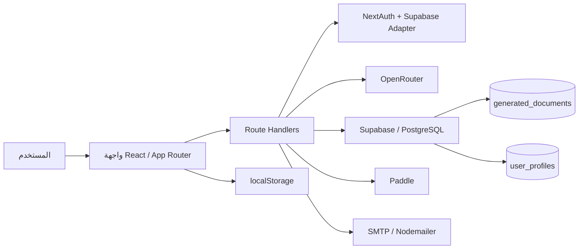
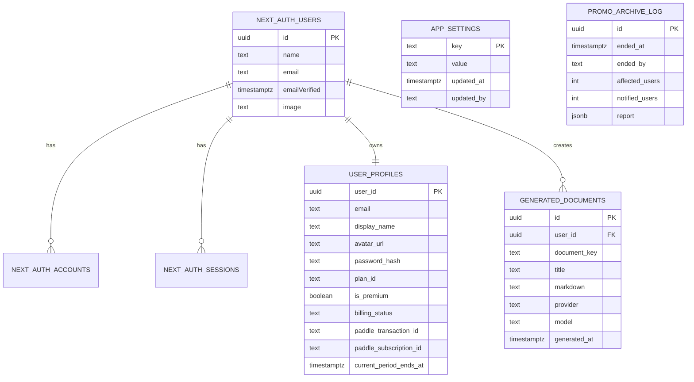
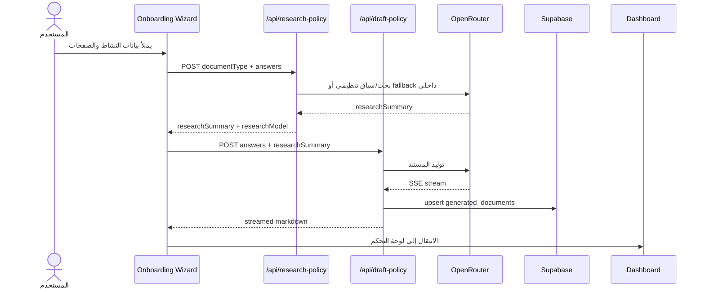
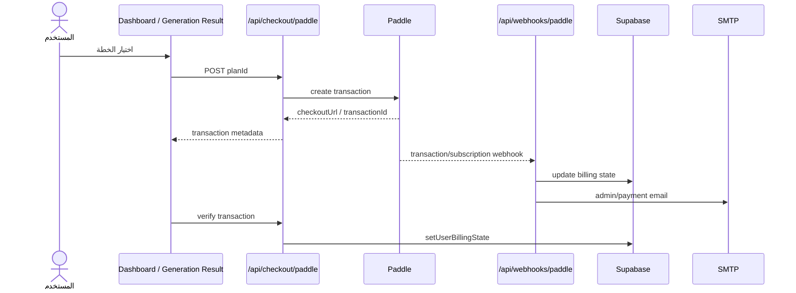

# تقرير التحليل الشامل لمشروع PolicyPack

تاريخ التحليل: 2026-04-16  
مسار المشروع: `C:\Users\ElBayyaa\Desktop\PolicyPack`

## الملخص التنفيذي

`PolicyPack` هو تطبيق SaaS مبني بالكامل على `Next.js App Router` لتوليد مستندات قانونية مخصّصة لمنتجات SaaS ومواقع الويب، مع دمج `OpenRouter` للتوليد، و`NextAuth` للمصادقة، و`Supabase/PostgreSQL` للتخزين، و`Paddle` للفوترة.

المشروع ناضج من ناحية البنية العامة أكثر من كونه MVP بسيطًا: توجد طبقات واضحة نسبيًا للواجهة، وواجهات API، والمنطق القانوني، والفوترة، والإشعارات، وقاعدة البيانات، مع CI يعمل ونتائج تنفيذية جيدة (`lint` و`typecheck` و`test` و`build` نجحت). لكن توجد فجوات مؤثرة يجب اعتبارها عالية الأولوية، أهمها:

1. تضارب الهوية القانونية للمشغّل بين ملفات المشروع.
2. تعقيم HTML الناتج من الذكاء الاصطناعي ضعيف مقارنة بحساسية `dangerouslySetInnerHTML`.
3. مسار البث في `/api/draft-policy` يمكن أن يفقد أجزاء من الاستجابة عند تقطيع SSE.
4. الوعود التسويقية الخاصة بـ "التحديث التلقائي" و"المراقبة" و"Version History" أوسع من التنفيذ الفعلي الحالي.
5. منطق الحملة الترويجية يعرض عدادًا غير صحيح (`0 spots remain`) رغم بقاء العرض نشطًا.

الخلاصة: المشروع قابل للتشغيل ويجتاز الفحوص التقنية الأساسية، لكنه يحتاج دورة تحسين مركزة على الاتساق القانوني، أمان العرض، موثوقية تدفق التوليد، وضبط المطابقة بين الخطاب التسويقي والتنفيذ الحقيقي.

## منهجية التحليل

تم تنفيذ التحليل عبر:

- مراجعة بنية المجلدات والملفات التعريفية الرئيسية.
- قراءة ملفات `src/app` و`src/components` و`src/lib` و`supabase` و`scripts`.
- تشغيل:
  - `npm run lint`
  - `npm run typecheck`
  - `npm run test`
  - `npm run test:coverage`
  - `npm run build`
  - `npm audit --json`
  - `npm outdated --json`
- استخراج المتطلبات الوظيفية وغير الوظيفية من التنفيذ الفعلي، لا من README فقط.

القيود:

- لم يتم التحقق من القيم الحقيقية في `.env.local` أو الخدمات الخارجية الحية.
- لم يتم اختبار تدفقات OAuth أو Paddle أو SMTP على حسابات إنتاجية فعلية.
- التقرير مبني على لقطة الكود الحالية داخل المستودع بتاريخ التحليل.

## نظرة عامة على المشروع

### الغرض

التطبيق يهدف إلى:

- تسجيل المستخدمين وإدارة حساباتهم.
- جمع بيانات المنتج/النشاط التجاري عبر Wizard.
- توليد 7 أنواع من الصفحات/المستندات القانونية:
  - `About Us`
  - `Contact Us`
  - `Privacy Policy`
  - `Cookie Policy`
  - `Terms of Service`
  - `Legal Disclaimer`
  - `Refund Policy`
- حفظ المستندات في `localStorage` محليًا ثم مزامنتها مع `Supabase`.
- إتاحة تصدير PDF للمستخدمين المدفوعين.
- إدارة عروض ترويجية مجانية محدودة.
- الترقية إلى خطط مدفوعة عبر `Paddle`.
- إرسال رسائل ترحيب وإشعارات إدارية وفواتير عبر SMTP.

### التقنيات المستخدمة

| المجال | التقنية |
|---|---|
| الواجهة + الخادم | `Next.js 16.2.3` |
| UI | `React 19.2.4`, `Tailwind CSS v4`, `Framer Motion`, `Base UI` |
| المصادقة | `next-auth@5 beta`, `@auth/supabase-adapter` |
| قاعدة البيانات | `Supabase`, `PostgreSQL 15` |
| الذكاء الاصطناعي | `OpenRouter`, حزم `ai` + استدعاءات `fetch` مباشرة |
| الفوترة | `@paddle/paddle-js`, `@paddle/paddle-node-sdk` |
| البريد | `nodemailer` |
| التحقق | `zod` |
| الاختبارات | `Vitest`, `Testing Library`, `jsdom` |
| الجودة | `ESLint`, CI على GitHub Actions |

## الجرد البنيوي للمشروع

### إحصاءات سريعة

- عدد ملفات المصدر تحت `src`: `110`
- عدد اختبارات `*.test.ts(x)`: `8`
- عدد صفحات `page.tsx`: `19`
- عدد مسارات API `route.ts`: `18`
- عدد مكونات `src/components`: `32`
- عدد وحدات `src/lib`: `26`
- عدد migrations داخل `supabase/migrations`: `2`

### البنية الرئيسية

| المسار | الدور |
|---|---|
| `README.md` | توثيق عام وإعداد البيئة |
| `package.json` | السكربتات والتبعيات |
| `docker-compose.yml` | قاعدة PostgreSQL محلية للتطوير |
| `.github/workflows/ci.yml` | CI للتأكد من `lint` و`typecheck` و`test` |
| `src/app` | صفحات App Router ومسارات API |
| `src/components` | مكونات الواجهة حسب النطاق |
| `src/lib` | المنطق التطبيقي، التوليد، الفوترة، الإشعارات، التخزين |
| `supabase/schema.sql` | مخطط القاعدة الكامل |
| `supabase/migrations` | تعديلات قاعدة البيانات |
| `scripts/regenerate-site-legal.mjs` | توليد الصفحات القانونية الداخلية للموقع |
| `src/lib/site-page-content.generated.json` | محتوى الصفحات القانونية المولّد |

### الملفات الرئيسية الملحوظة

- `README.md`: جيد كبداية، لكنه لا يعكس بدقة بعض تفاصيل التنفيذ الحالية.
- `package.json`: منظم؛ يفرض `Node >=24` ويوفر سكربتات تشغيل وبناء واختبار وتغطية.
- `docker-compose.yml`: مناسب للتطوير المحلي فقط، مع كلمة مرور ثابتة ومكشوفة.
- `eslint.config.mjs`: موجود وفعال.
- لا يوجد إعداد `Prettier` داخل المشروع.

## المعمارية العامة

المشروع ليس فيه Backend منفصل؛ طبقة الخادم مبنية عبر `Next.js route handlers`.

### ملاحظات معمارية

- يوجد فصل معقول بين العرض (`components`) والمنطق (`lib`) والـ routes.
- التطبيق يعتمد على `localStorage` + `Supabase` معًا، وهي فكرة عملية لكنها تزيد التعقيد.
- الذكاء الاصطناعي موزّع بين:
  - بحث/سياق تنظيمي
  - صياغة المستند
  - محتوى الصفحات القانونية الخاصة بالموقع نفسه
- الفوترة تعتمد على نمطين:
  - إنشاء المعاملة/فتح Checkout
  - التحقق من المعاملة أو استقبال webhook

## المتطلبات الوظيفية المستخرجة

### 1. إدارة الحسابات

- تسجيل مستخدم بكلمة مرور عبر `/api/auth/register`
- تسجيل دخول Credentials أو Google OAuth
- تعديل الاسم
- تغيير كلمة المرور
- حذف الحساب
- إدارة جلسة JWT مع بيانات Premium مدمجة

### 2. التهيئة القانونية (Onboarding)

- اختيار الصفحات القانونية المطلوبة
- إدخال بيانات الشركة، الموقع، الوصف، المناطق، البيانات المجمعة، المزودين، قنوات التواصل
- دعم قيم "Other" مخصصة
- ربط الأسئلة بالصفحات المختارة عبر `PAGE_QUESTION_MAP`

### 3. توليد المستندات

- بحث تنظيمي عبر `/api/research-policy`
- صياغة مستند عبر `/api/draft-policy`
- دعم fallback داخلي عند غياب أو فشل `OpenRouter`
- حفظ المستندات المولدة في `generated_documents`

### 4. لوحة التحكم

- عرض المستندات المولدة
- عرض حالة الامتثال
- فتح المستند داخل Modal
- تشغيل "Audit" محلي
- حفظ الحالة في الحساب
- تصدير PDF للمستخدم المدفوع

### 5. الفوترة والترقية

- خطط: `free`, `promo`, `starter`, `premium`
- إنشاء معاملة Paddle
- دعم أكواد خصم
- التحقق من المعاملة من الواجهة
- تحديث حالة الفوترة عبر webhook

### 6. الإدارة

- لوحة مستخدمين للمشرف
- حذف مستخدمين
- إدارة نهاية العرض الترويجي
- rollback خلال 24 ساعة

### 7. الصحة والتشخيص

- Healthcheck للبريد `/api/health/notifications`
- Dev endpoint لإرسال إيميلات تجريبية

## المتطلبات غير الوظيفية المستخرجة

### الجودة والاعتمادية

- TypeScript strict mode مفعّل.
- ESLint مفعّل ونجح.
- CI موجود.
- توجد اختبارات لوحدات مختارة ومسارات حرجة (خاصة Paddle والصحة).

### الأداء

- بناء الإنتاج نجح.
- `maxDuration = 55/60` مضبوط لعدد من المسارات.
- بعض التدفقات مصممة لتجنب تجاوز حدود Vercel الزمنية.

### الأمان

- الجلسة محمية عبر NextAuth.
- التحقق من توقيع Paddle webhook موجود.
- السماح الإداري يعتمد على allowlist للبريد.
- يوجد rate limit بسيط لبعض المسارات فقط.

### قابلية الصيانة

- فصل الملفات جيد إجمالًا.
- توجد مشكلات Drift بين الوثائق والكود والمحتوى المولد.
- توجد مؤشرات على debt تقني في النصوص المولدة والهوية القانونية.

## مراجعة الطبقات البرمجية

### الواجهة الأمامية Frontend

نقاط القوة:

- تصميم واجهات غني وواضح، مع هوية بصرية متماسكة.
- تقسيم المكونات حسب النطاق: `auth`, `billing`, `dashboard`, `legal`, `settings`.
- مكونات مثل `PlanSelectionDialog`, `GenerationResult`, `ComplianceDashboard` مبنية حول تدفقات واضحة.

نقاط الضعف:

- مكونات كبيرة جدًا مثل:
  - `src/components/onboarding/onboarding-wizard.tsx`
  - `src/components/dashboard/compliance-dashboard.tsx`
- هذا يزيد صعوبة الفهم، الاختبار، وإعادة الاستخدام.
- توجد سلاسل نصية/رموز معطوبة (mojibake) ظاهرة في الواجهة، مثل:
  - `src/components/layout/site-footer.tsx:23-25`
  - `src/components/sections/launch-risk.tsx:71-73`

### الواجهة الخلفية / API

المسارات مغطاة بشكل جيد وظيفيًا:

- Auth / Account
- Research / Draft
- Paddle Checkout / Client Token / Webhook
- Admin Users / Promo
- Health / Dev

نقاط القوة:

- تحقق وصول مناسب.
- استخدام `zod` في التحقق لعدد من endpoints.
- حماية معقولة للتعاملات المالية.

نقاط الضعف:

- endpoints الذكية المكلفة (`research-policy`, `draft-policy`) لا تطبق rate limiting.
- منطق البث في `/api/draft-policy` هش.
- endpoint إنهاء الحملة الترويجية ينفذ إرسال الإيميلات بشكل تسلسلي داخل request واحد.

### طبقة الذكاء الاصطناعي

نقاط القوة:

- وجود fallback واضح عند غياب API key.
- فصل إعدادات الموديلات في `ai-config.ts`.
- مراعاة tier مجاني/مدفوع.

نقاط الضعف:

- التنفيذ الفعلي الآن أقرب إلى single-stage enriched drafting من كونه two-stage كاملًا.
- المحتوى "التنظيمي" fallback يحتوي افتراضات قانونية ثابتة داخل الكود وليس مصدرًا حيًا.
- التوصيف التسويقي والـ README يوحيان بقدرة "always up to date" أقوى من الواقع الحالي.

### قاعدة البيانات

الجداول الأساسية:

- `next_auth.users`
- `next_auth.accounts`
- `next_auth.sessions`
- `next_auth.verification_tokens`
- `public.user_profiles`
- `public.generated_documents`
- `public.app_settings`
- `public.promo_archive_log`

نقاط القوة:

- الفهارس الأساسية موجودة.
- العلاقات الأساسية صحيحة.
- RLS مفعّل على الجداول الحساسة.

ملاحظات:

- الاعتماد الحالي فعليًا على Service Role Key، وبالتالي RLS ليس جزءًا فعّالًا من تدفق التطبيق الحالي.
- `schema.sql` يعمل كـ snapshot كبير، بينما `migrations` قليلة ومكررة جزئيًا؛ وهذا يعرض المشروع لخطر drift.

### الاختبارات

الموجود:

- اختبارات لوحدات المنطق `policy-engine`, `billing-state`, `auth-env`
- اختبارات للمكونات الحرجة `plan-selection-dialog`, `generation-result`
- اختبارات لمسارات:
  - `checkout/paddle`
  - `webhooks/paddle`
  - `health/notifications`

النتيجة التنفيذية:

- جميع الاختبارات نجحت: `36/36`
- تغطية عامة:
  - Statements: `68.9%`
  - Branches: `56.01%`
  - Functions: `73.33%`
  - Lines: `69.8%`

فجوات مهمة:

- `src/lib/auth-env.ts` تغطية منخفضة جدًا: `24.39%`
- `src/lib/site-config.ts` تغطية: `33.33%`
- `src/app/api/webhooks/paddle/route.ts` تغطية: `54.8%`
- لا توجد اختبارات مباشرة لمسارات التسجيل، التوليد، الإدارة، والإعدادات.

## نتائج الفحوص التنفيذية

| الفحص | النتيجة |
|---|---|
| `npm run lint` | نجح |
| `npm run typecheck` | نجح |
| `npm run test` | نجح |
| `npm run test:coverage` | نجح |
| `npm run build` | نجح، مع warning منطقي يتعلق بـ `dashboard` |
| `npm audit` | وُجدت ثغرة transitive متوسطة واحدة |
| `npm outdated` | توجد عدة تحديثات patch/minor ومجموعة تحديثات major اختيارية |

### ملاحظة build

رغم نجاح البناء، ظهر log متعلق بـ `Dynamic server usage` لصفحة `/dashboard` بسبب استخدام `auth()`/`headers` داخل مسار غير معلن صراحة كـ dynamic:

- الملف: `src/app/dashboard/page.tsx:20-24`

هذا لا يكسر البناء الآن، لكنه مؤشر على سوء ضبط بسيط لمسار SSR.

## جرد التبعيات الخارجية والإصدارات

### تبعيات الإنتاج المباشرة

| الحزمة | الإصدار |
|---|---|
| `@auth/supabase-adapter` | `^1.11.1` |
| `@base-ui/react` | `^1.3.0` |
| `@paddle/paddle-js` | `^1.6.2` |
| `@paddle/paddle-node-sdk` | `^3.6.1` |
| `@supabase/supabase-js` | `^2.103.0` |
| `ai` | `^6.0.159` |
| `bcryptjs` | `^3.0.3` |
| `class-variance-authority` | `^0.7.1` |
| `clsx` | `^2.1.1` |
| `framer-motion` | `^12.38.0` |
| `html2pdf.js` | `^0.14.0` |
| `isomorphic-dompurify` | `^3.8.0` |
| `lucide-react` | `^1.7.0` |
| `marked` | `^18.0.0` |
| `next` | `^16.2.3` |
| `next-auth` | `^5.0.0-beta.30` |
| `nodemailer` | `^8.0.5` |
| `react` | `19.2.4` |
| `react-dom` | `19.2.4` |
| `shadcn` | `^4.2.0` |
| `tailwind-merge` | `^3.5.0` |
| `tw-animate-css` | `^1.4.0` |
| `zod` | `^4.3.6` |

### تبعيات التطوير المباشرة

| الحزمة | الإصدار |
|---|---|
| `@tailwindcss/postcss` | `^4` |
| `@testing-library/dom` | `^10.4.1` |
| `@testing-library/react` | `^16.3.2` |
| `@types/node` | `^20` |
| `@types/react` | `^19` |
| `@types/react-dom` | `^19` |
| `@vitejs/plugin-react` | `^6.0.1` |
| `@vitest/coverage-v8` | `^4.1.4` |
| `eslint` | `^9` |
| `eslint-config-next` | `^16.2.3` |
| `jsdom` | `^29.0.2` |
| `tailwindcss` | `^4` |
| `typescript` | `^5` |
| `vitest` | `^4.1.4` |

### تحديثات متاحة

أهم التحديثات minor/patch:

| الحزمة | الحالي | المطلوب/الأحدث |
|---|---:|---:|
| `next` | `16.2.3` | `16.2.4` |
| `eslint-config-next` | `16.2.3` | `16.2.4` |
| `@supabase/supabase-js` | `2.103.0` | `2.103.3` |
| `@paddle/paddle-node-sdk` | `3.6.1` | `3.7.0` |
| `ai` | `6.0.159` | `6.0.167` |
| `@base-ui/react` | `1.3.0` | `1.4.0` |
| `lucide-react` | `1.7.0` | `1.8.0` |
| `isomorphic-dompurify` | `3.8.0` | `3.9.0` |
| `shadcn` | `4.2.0` | `4.3.0` |

تحديثات major اختيارية:

- `eslint` من `9` إلى `10`
- `typescript` من `5` إلى `6`
- `@types/node` من `20` إلى `25`

### الثغرات الأمنية

نتيجة `npm audit`:

- ثغرة واحدة `moderate`
- الحزمة المتأثرة: `hono < 4.12.14`
- المسار: `shadcn -> @modelcontextprotocol/sdk -> hono`
- المعرّف: `GHSA-458j-xx4x-4375`
- نوع الأثر: HTML injection في SSR لـ `hono/jsx`
- `fixAvailable: true`

استنتاج مهم:

- هذه الثغرة ليست في كود التطبيق المباشر، بل في dependency transitively brought by `shadcn`.
- `shadcn` لا يظهر استخدامًا runtime داخل `src`، وبالتالي الأرجح أنه يجب أن يكون `devDependency` أو يُزال إن لم يعد مطلوبًا.

## قاعدة البيانات والعلاقات

## جرد واجهات API

### Auth / Account

| المسار | الغرض |
|---|---|
| `POST /api/auth/register` | إنشاء حساب Credentials |
| `GET/POST /api/auth/[...nextauth]` | NextAuth handlers |
| `DELETE /api/account` | حذف الحساب |
| `PATCH /api/account/profile` | تعديل الاسم |
| `PATCH /api/account/password` | تغيير كلمة المرور |

### Generation

| المسار | الغرض |
|---|---|
| `POST /api/research-policy` | جلب بحث تنظيمي/سياق |
| `POST /api/draft-policy` | صياغة المستند وحفظه |
| `POST /api/render-policy-html` | تحويل markdown إلى HTML للطباعة/التصدير |

### Billing

| المسار | الغرض |
|---|---|
| `POST /api/checkout/paddle` | إنشاء أو التحقق من معاملة Paddle |
| `GET /api/checkout/paddle/client-token` | جلب أو إنشاء client token |
| `POST /api/webhooks/paddle` | مزامنة حالة الفوترة من Paddle |

### Admin / Ops

| المسار | الغرض |
|---|---|
| `GET /api/admin/users` | قائمة المستخدمين |
| `DELETE /api/admin/users/[userId]` | حذف مستخدم |
| `GET /api/admin/promo/status` | حالة العرض الترويجي |
| `POST /api/admin/promo/end` | إنهاء العرض |
| `POST /api/admin/promo/rollback` | rollback |
| `GET /api/health/notifications` | فحص SMTP |
| `POST /api/dev/send-test-email` | إرسال بريد تجريبي في غير الإنتاج |

## أهم النتائج والمشكلات التقنية

### 1. تضارب الهوية القانونية للمشروع

الأثر: **عالٍ جدًا**

الأدلة:

- `src/lib/company.ts:3-9` يعرّف الكيان على أنه `PolicyPack` مع `COMPANY_JURISDICTION = "Egypt"`.
- `scripts/regenerate-site-legal.mjs:24-30` يعرّف الكيان على أنه `Superlinear Technology Pte. Ltd.` في `Singapore`.
- `src/app/about-us/page.tsx` يصف الشركة بأنها `Superlinear Technology Pte. Ltd.`.
- `src/lib/site-page-content.ts` يطبّع نصوصًا قانونية على أساس سنغافورة.

المخاطر:

- تضارب قانوني مباشر بين صفحات الموقع، الوثائق المولدة، والفوترة والإشعارات.
- احتمالية رفض من Paddle أو مراجعات قانونية أو التباس للمستخدم النهائي.

### 2. تعقيم HTML غير كافٍ قبل `dangerouslySetInnerHTML`

الأثر: **عالٍ**

الأدلة:

- `src/lib/legal-document.ts:19-24` يستخدم regex sanitizer بسيط.
- `src/components/legal/legal-document-renderer.tsx:13-15` يحقن HTML مباشرة.
- توجد dependency جاهزة `isomorphic-dompurify` في `package.json` لكنها غير مستخدمة.

المخاطر:

- مستندات قانونية ناتجة من AI أو Markdown غير موثوق يمكن أن تمرر عناصر HTML خطرة غير مغطاة بهذا التعقيم البسيط.
- الخطر يشمل العرض داخل الواجهة وHTML التصديري.

### 3. parser البث في `/api/draft-policy` يمكن أن يفقد أجزاء من الاستجابة

الأثر: **عالٍ**

الأدلة:

- `src/app/api/draft-policy/route.ts:116-137`
- الكود يجزّئ كل chunk على `\n` ويعمل `JSON.parse` مباشرة على كل سطر.
- عند انقسام event JSON بين chunk وآخر يتم تجاهل الخطأ (`catch {}`) دون buffer تجميعي.

المخاطر:

- فقدان كلمات أو فقرات من المستند النهائي.
- اختلاف بين ما يراه المستخدم أثناء البث وما يُحفظ في القاعدة.

### 4. الخطاب التسويقي والـ README أوسع من التنفيذ الفعلي

الأثر: **عالٍ وظيفيًا/منتجيًا**

الأدلة:

- `README.md:72-74` يصف "Two-Stage AI Generation".
- `src/lib/policy-generator.ts:80-90` يوضح أن التنفيذ الحالي single-stage enriched drafting.
- `src/components/sections/hero.tsx:22-25` و`85-94` يَعِدان بـ "Always Up to Date" و"Auto-updates".
- `src/components/sections/features.tsx:23-29` و`45-49` يذكران "Auto-Monitoring" و"Version history".
- `src/lib/audit-engine.ts:26-87` يبيّن أن المراقبة الحالية قائمة على قائمة static rules داخل الكود، لا محرك live monitoring حقيقي.

المخاطر:

- فجوة ثقة مع العملاء.
- مخاطر قانونية/تجارية إذا اعتُبر المنتج يَعِد بقدرات غير متحققة بالكامل.

### 5. منطق العرض الترويجي يعرض عدادًا غير صحيح

الأثر: **متوسط**

الأدلة:

- `src/lib/launch-campaign.ts:65-66` يثبت `freeUserLimit = 0` و`freeSpotsRemaining = 0`.
- `src/components/sections/pricing.tsx:29-31` يعرض النص بناء على `freeSpotsRemaining`.

المخاطر:

- الصفحة التسعيرية قد تعرض "0 complimentary launch spots remain" حتى أثناء نشاط العرض.
- هذا يسبب تعارضًا مباشرًا مع `bannerText` وباقي منطق promo.

### 6. Warning build متعلق بـ dashboard dynamic rendering

الأثر: **متوسط**

الأدلة:

- أثناء `npm run build` ظهر log `Dynamic server usage`.
- المسار المرتبط: `src/app/dashboard/page.tsx:20-24`.

المخاطر:

- ضوضاء في البناء وصعوبة التتبع.
- قابلية ظهور أخطاء مستقبلية إذا تغير سلوك Next.js مع المسارات الديناميكية.

### 7. إنهاء الحملة الترويجية ينفذ الإشعارات بشكل تسلسلي داخل request واحد

الأثر: **متوسط**

الأدلة:

- `src/app/api/admin/promo/end/route.ts:63-100`
- يوجد `for ... await transporter.sendMail(...)` على كل مستخدم.
- نفس route محدد له `maxDuration = 60`.

المخاطر:

- timeout عند زيادة عدد المستخدمين.
- تنفيذ جزئي، rollback غير نظيف، أو تأخير إداري ملحوظ.

### 8. مسارات الذكاء الاصطناعي المكلفة بلا rate limiting

الأثر: **متوسط**

الأدلة:

- `src/app/api/research-policy/route.ts`
- `src/app/api/draft-policy/route.ts`
- لا يوجد استدعاء `rateLimit()` كما هو موجود مثلًا في التسجيل وتغيير كلمة المرور.

المخاطر:

- إساءة استخدام من حسابات مسجلة.
- ارتفاع التكلفة على OpenRouter.

### 9. Hygiene issues في التبعيات

الأثر: **متوسط**

الأدلة:

- `shadcn` في dependencies رغم عدم ظهور استخدام runtime داخل `src`.
- `html2pdf.js` موجود لكن `src/lib/pdf-export.ts:152-155` يستورد `jspdf` مباشرة، أي اعتماد على dependency transitive.
- `isomorphic-dompurify` موجود لكنه غير مستخدم.
- `npm audit` كشف ثغرة transitive عبر مسار `shadcn`.

المخاطر:

- تضخم bundle أو بيئة الإنتاج بلا داع.
- هشاشة مستقبلية إذا تغيّرت تبعيات `html2pdf.js`.

### 10. نصوص معطوبة وMojibake في أماكن ظاهرة

الأثر: **منخفض إلى متوسط**

الأدلة:

- `src/components/layout/site-footer.tsx:23-25`
- `src/components/sections/launch-risk.tsx:71-73`
- `src/lib/site-page-content.ts:11-38` يحتوي طبقة تطبيع كبيرة لمعالجة encoding artifacts.

المخاطر:

- مخرجات UI غير نظيفة.
- صعوبة صيانة المحتوى القانوني.

### 11. `sitemap` يتضمن مسارات محمية

الأثر: **منخفض**

الأدلة:

- `src/app/sitemap.ts:57-68` يضيف `/onboarding` و`/dashboard`.

المخاطر:

- زحف غير مفيد لمحركات البحث على صفحات تعيد redirect/login.

## تقييم جودة الكود

### التسمية والتنظيم

التقييم: **جيد**

- أسماء الملفات والوظائف غالبًا واضحة.
- تقسيم المسؤوليات منطقي.
- أسماء المسارات متسقة.

### التعليقات

التقييم: **متوسط**

- توجد تعليقات مفيدة في عدة مواضع.
- يوجد أيضًا drift بين التعليق والتنفيذ الفعلي.
- بعض التعليقات والنصوص تعاني من مشاكل encoding.

### ESLint / Prettier

- `ESLint`: موجود ويعمل بنجاح.
- `Prettier`: لا يوجد إعداد واضح داخل المشروع.

التقييم: **جيد في linting، ناقص في formatting standardization**

### التغطية الاختبارية

التقييم: **متوسط**

إيجابيات:

- تغطية جيدة نسبيًا للمناطق المالية الحساسة.
- وجود اختبارات للمكونات الأساسية في التدفق التجاري.

سلبيات:

- التغطية العامة أقل من مستوى مشروع إنتاجي عالي الحساسية.
- مسارات الإدارة والتوليد والحماية القانونية تحتاج اختبارات أوسع.

## ملاحظات على البنية التحتية والبيئة

### `docker-compose.yml`

- مناسب للتطوير المحلي.
- يحتوي كلمة مرور ثابتة وport mapping مباشر:
  - `docker-compose.yml:7-16`
- يطبّق `schema.sql` فقط، وليس سلسلة migrations؛ وهذا يزيد احتمال drift بين البيئات.

### CI

- `ci.yml` يشغّل:
  - `lint`
  - `typecheck`
  - `test`
- لا يشغّل:
  - `build`
  - `test:coverage`
  - `npm audit`

ملاحظة:

- إضافة `build` إلى CI ستكون خطوة منخفضة الجهد وعالية القيمة.

## مخططات التسلسل

### تدفق التوليد

### تدفق الفوترة

## التوصيات والإجراءات المقترحة

| الأولوية | الإجراء | الجهد | الأثر |
|---|---|---|---|
| P1 | توحيد الهوية القانونية في `company.ts` و`site-page-content.ts` و`regenerate-site-legal.mjs` مع مصدر وحيد للحقيقة | متوسط | عالٍ جدًا |
| P1 | استبدال sanitizer الحالي بـ `DOMPurify`/`isomorphic-dompurify` وتغطية ذلك باختبارات XSS | متوسط | عالٍ |
| P1 | إصلاح parser البث في `/api/draft-policy` بإضافة buffer حقيقي أو استخدام stream helper موثوق | متوسط | عالٍ |
| P1 | مراجعة الرسائل التسويقية والـ README لتطابق التنفيذ الحالي أو تنفيذ monitoring/versioning فعليين | متوسط | عالٍ |
| P2 | إصلاح منطق `freeSpotsRemaining` أو حذف العداد من الواجهة إذا لم يعد جزءًا من النموذج | صغير | متوسط |
| P2 | إضافة `export const dynamic = "force-dynamic"` أو إعادة ضبط منطق `/dashboard` لتجنب build warning | صغير | متوسط |
| P2 | نقل إنهاء promo إلى background job/queue بدل request متزامن | متوسط | متوسط |
| P2 | إضافة rate limiting على `/api/research-policy` و`/api/draft-policy` | صغير | متوسط |
| P2 | نقل `shadcn` إلى `devDependencies`، وإضافة `jspdf` dependency مباشرة، وإزالة/استخدام `isomorphic-dompurify` | صغير | متوسط |
| P2 | تحديث الحزم patch/minor المذكورة أعلاه ومعالجة ثغرة `hono` | صغير | متوسط |
| P3 | إضافة `npm run build` و`npm audit` إلى CI | صغير | متوسط |
| P3 | إزالة mojibake من النصوص الثابتة والمحتوى المولد | صغير | منخفض |
| P3 | حذف `/dashboard` و`/onboarding` من `sitemap` | صغير | منخفض |
| P3 | إضافة Prettier أو توثيق معيار تنسيق موحد | صغير | منخفض |
| P3 | رفع التغطية الاختبارية فوق 80% للطبقات الحرجة | متوسط إلى كبير | عالٍ |

## نقاط القوة

- نجاح `lint`, `typecheck`, `test`, `coverage`, `build`.
- بنية Next.js حديثة ومنظمة.
- تدفقات الفوترة والمصادقة مفصولة بوضوح.
- وجود CI فعّال كبداية جيدة.
- منطق الخطط والصفحات والحملة الترويجية واضح نسبيًا.
- استخدام `zod`, `server-only`, واختبارات لمسارات مالية حساسة.

## نقاط الضعف

- اتساق قانوني ضعيف بين الملفات.
- أمان rendering للمحتوى القانوني غير كافٍ.
- فجوة بين التسويق والتنفيذ.
- تغطية اختبارية متوسطة فقط.
- بعض التبعيات غير نظيفة أو غير مستعملة تشغيلًا.
- بعض النصوص الثابتة والـ generated content بها مشاكل encoding.

## المخاطر الرئيسية

1. **مخاطر قانونية/تجارية** بسبب تضارب هوية المشغّل.
2. **مخاطر أمنية** بسبب عرض HTML مولّد بتعقيم محدود.
3. **مخاطر موثوقية المنتج** بسبب فقد محتمل للمحتوى أثناء streaming.
4. **مخاطر ثقة السوق** بسبب ادعاءات مراقبة/تحديثات أوسع من التنفيذ.
5. **مخاطر تشغيلية** بسبب sequential promo notifications وغياب rate limit على AI endpoints.

## الخلاصة النهائية

المشروع قوي من ناحية الهيكل العام وقابل للتشغيل الآن، لكنه يحتاج "جولة تشديد" واضحة قبل اعتباره منصة قانونية موثوقة بالكامل في الإنتاج. الأولوية القصوى ليست في تحسين الشكل أو إضافة ميزات جديدة، بل في:

- توحيد الهوية القانونية.
- تأمين rendering للمحتوى.
- تثبيت موثوقية تدفق التوليد.
- تقليل الفجوة بين الرسائل التسويقية والتنفيذ الحقيقي.

بعد تنفيذ هذه المجموعة، يمكن اعتبار المشروع في وضع صحي جدًا للانتقال من "منتج واعد" إلى "منتج يمكن الدفاع عنه تقنيًا وتشغيليًا".
## ملحق التنفيذ - 2026-04-16

تم تنفيذ التوصيات الأعلى أولوية داخل الشجرة الحالية، وتشمل:

- توحيد الهوية القانونية في `src/lib/company.ts` وربط الصفحات التعريفية بها.
- استبدال تعقيم HTML اليدوي بـ `isomorphic-dompurify`.
- إصلاح parsing الخاص بـ SSE في `/api/draft-policy` مع إضافة rate limiting إلى مساري البحث والتوليد.
- مواءمة النصوص التسويقية وREADME وصفحات التسعير والمزايا والـFAQ مع التنفيذ الفعلي الحالي.
- إزالة التعارض في عداد العرض الترويجي داخل الواجهة، وتحويل إشعارات إنهاء العرض إلى batching بدل الإرسال التسلسلي.
- جعل `/dashboard` ديناميكيًا صراحة، وإزالة المسارات المحمية من `sitemap`.
- تنظيف التبعيات: إضافة `jspdf` بشكل مباشر، إزالة الاعتماد التشغيلي غير المستخدم `html2pdf.js`، نقل `shadcn` إلى `devDependencies`، إضافة Prettier، وتحديث الحزم الأساسية مع `npm audit` نظيف.
- توسيع CI ليشمل `build` و`npm audit --omit=dev --audit-level=moderate`.

حالة التحقق بعد التنفيذ:

- `npm run lint` ناجح
- `npm run typecheck` ناجح
- `npm run test` ناجح
- `npm run build` ناجح
- `npm audit --omit=dev --audit-level=moderate` ناجح
