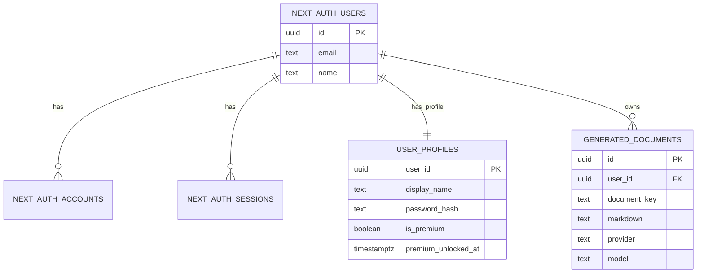
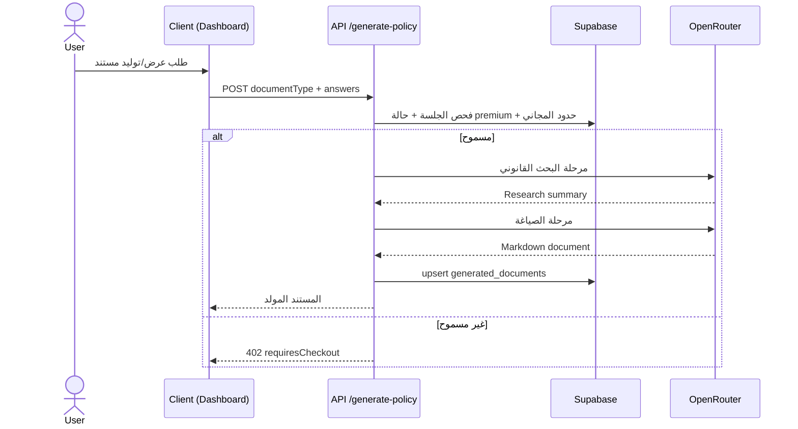
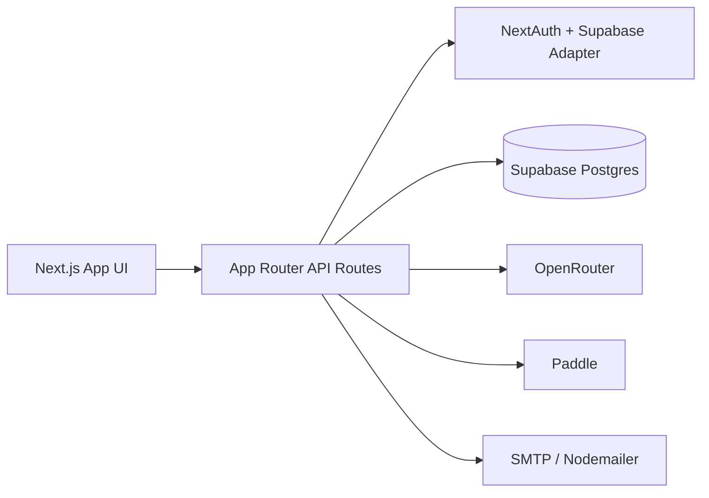

# تقرير التحليل الشامل لمشروع PolicyPack

تاريخ التحليل: 2026-04-11  
نطاق التحليل: البنية، الوحدات البرمجية، التبعيات، الأمن، الجودة، المخاطر، والتوصيات.

## 1) الملخص التنفيذي

### نظرة عامة
مشروع **PolicyPack** هو منصة SaaS مبنية على **Next.js 16 (App Router)** لتوليد مستندات قانونية مخصصة (Privacy Policy / Terms / Cookie / GDPR Addendum) باستخدام ذكاء اصطناعي عبر OpenRouter، مع:
- مصادقة عبر **NextAuth v5 beta** و **Supabase Adapter**.
- تخزين حسابات/مستندات في **Supabase Postgres**.
- دفع وترقية عبر **Paddle**.
- واجهة أمامية React + Tailwind + مكونات مخصصة.

### النتائج الرئيسية
**نقاط القوة**
- تدفق وظيفي واضح من Onboarding إلى Dashboard إلى التصدير.
- تكاملات إنتاجية حقيقية (Supabase + Paddle + OpenRouter) وليست Mock فقط.
- فصل مقبول بين طبقات العرض والمنطق (`src/components` مقابل `src/lib`).
- تحقق من توقيع Webhook Paddle موجود ومفعل.
- البناء والإختبارات ووضع TypeScript يعملون بدون فشل.

**نقاط الضعف**
- ملف README ما زال قالب افتراضي وغير معبر عن المشروع.
- اختبارات قليلة جدًا (ملفان فقط، 7 اختبارات) وتغطية غير مقاسة.
- فشل lint بسبب أخطاء `any` في الاختبارات.
- وجود حزمة متأثرة بثغرات أمنية (Nodemailer) بحسب `npm audit`.
- ملفات كبيرة جدًا (God Components/Modules) تزيد صعوبة الصيانة.

**المخاطر**
- أمنية: ثغرات dependencies + عدم وجود rate limiting واضح على endpoints الحساسة.
- تشغيلية: نقص توثيق إعداد البيئة (`.env.example` غير موجود).
- جودة: CI لا يشغّل typecheck صريح ولا audit أمني.
- قابلية التوسع: منطق كثيف داخل مكونات طويلة جدًا (خصوصًا Dashboard).

---

## 2) مراجعة بنية المشروع والملفات الرئيسية

## بنية عليا
- `.github/workflows/ci.yml`: CI لتشغيل lint + test فقط.
- `src/`: الكود الأساسي (81 ملف TS/TSX تقريبًا، 12303 سطر تقريبًا).
- `supabase/schema.sql`: مخطط قاعدة البيانات.
- `docker-compose.yml`: PostgreSQL محلي للتطوير.
- `scripts/regenerate-site-legal.mjs`: توليد المحتوى القانوني للموقع.
- `README.md`: ما يزال قالب Next.js الافتراضي.

## ملفات إعداد رئيسية
- `package.json`: scripts أساسية (`dev`, `build`, `lint`, `test`) + تبعيات Next/Auth/Supabase/Paddle.
- `docker-compose.yml`: خدمة `postgres:15-alpine` مع ربط `supabase/schema.sql`.
- `eslint.config.mjs`: Next Core Web Vitals + TypeScript.
- `tsconfig.json`: strict mode مفعل.
- `vitest.config.ts`: بيئة اختبار `jsdom`.

## ملاحظات مهمة
- يوجد `docker-compose.yml` فعليًا (بعكس تقارير سابقة غير محدثة).
- لا يوجد ملف `.prettierrc` ولا `.env.example`.
- `next.config.ts` شبه فارغ.

---

## 3) فحص الكود المصدري حسب الوحدات

## A) الواجهة الأمامية Frontend
- المسارات في `src/app` تشمل: الصفحة الرئيسية، onboarding، dashboard، صفحات قانونية ثابتة.
- `src/components/onboarding/onboarding-wizard.tsx` يدير 11 سؤالًا ديناميكيًا ويحفظ الحالة في localStorage.
- `src/components/dashboard/compliance-dashboard.tsx` يحتوي منطقًا مركزيًا كبيرًا: توليد المستندات، التصدير، الدفع، التحقق من المعاملة.
- صفحات auth (`login-form`, `register-form`) واضحة UX وتدعم Google Sign-in شرط تهيئة البيئة.

**ملاحظة هندسية:** مكون `compliance-dashboard.tsx` بطول ~1414 سطر يحتاج تفكيكًا إلى hooks/services.

## B) طبقة الـ API / Backend داخل Next.js
أهم المسارات:
- `POST /api/generate-policy`: يتحقق من الجلسة، يفرض حدود المجاني، يولد مستند، ثم يحفظه.
- `POST /api/render-policy-html`: يعيد HTML قابل للطباعة (وليس PDF binary).
- `POST /api/checkout/paddle`: تهيئة Checkout/Verify transaction.
- `GET /api/checkout/paddle/client-token`: جلب/توليد token للـ Paddle.js.
- `POST /api/webhooks/paddle`: يتحقق من توقيع الويبهوك ثم يحدّث premium.
- `POST /api/auth/register`: إنشاء مستخدم credentials.
- `PATCH /api/account/password|profile`, `DELETE /api/account`: إدارة الحساب.

**نقاط أمنية جيدة**
- التحقق من session موجود في المسارات الحساسة.
- webhook signature verification موجود.
- كلمات المرور مجزأة بـ bcrypt.

**ثغرات/نواقص تشغيلية**
- لا يوجد rate limiting واضح على register / password / checkout / webhook.
- التحقق من email في التسجيل بسيط جدًا (`includes("@")`).

## C) قاعدة البيانات
`supabase/schema.sql` ينشئ:
- `next_auth.users`, `accounts`, `sessions`, `verification_tokens`.
- `public.user_profiles`.
- `public.generated_documents`.
- `RLS` مفعل على الجداول التطبيقية (`user_profiles`, `generated_documents`).

**ملاحظات**
- لا توجد سياسات RLS مفصلة لأن التطبيق يعتمد service role على الخادم.
- هناك فهرس على `generated_documents.user_id` (جيد).

## D) منطق الأعمال Business Logic
- `auth-data.ts`: طبقة رئيسية للتعامل مع Supabase (users/profiles/password/premium/docs).
- `policy-engine.ts`: تطبيع إجابات onboarding وبناء snapshot امتثال.
- `policy-generator.ts`: توليد على مرحلتين (Research + Drafting) مع fallback template عند فشل المزود.
- `paddle.ts`: تهيئة البيئة والأسعار والتحقق من mismatch.
- `notifications.ts`: إرسال تنبيهات بريدية للإدارة.

## E) الاختبارات
- ملفا اختبار فقط:
  - `src/lib/policy-engine.test.ts`
  - `src/lib/auth-env.test.ts`
- إجمالي الاختبارات المنفذة: **7** (نجحت كلها).

---

## 4) التبعيات الخارجية والإصدارات والثغرات

## تبعيات أساسية (مختصر)
- Next.js: `^16.2.3`
- React / React DOM: `19.2.4`
- next-auth: `^5.0.0-beta.30`
- @supabase/supabase-js: `^2.103.0`
- @auth/supabase-adapter: `^1.11.1`
- @paddle/paddle-js: `^1.6.2`
- @paddle/paddle-node-sdk: `^3.6.1`
- nodemailer: `^7.0.5`
- vitest: `^4.1.4`
- eslint: `^9`

## نتائج `npm audit --json`
- إجمالي الثغرات: 4
  - Moderate: 1
  - Low: 3
- الأهم: **nodemailer** متأثر بـ advisories مرتبطة بحقن SMTP.
- كذلك يظهر تأثير غير مباشر على `@auth/core` و `next-auth` عبر nodemailer.

## نتائج `npm outdated --json` (أمثلة مهمة)
- `@paddle/paddle-node-sdk`: 3.6.1 → 3.7.0
- `lucide-react`: 1.7.0 → 1.8.0
- `react/react-dom`: 19.2.4 → 19.2.5
- `nodemailer`: 7.0.13 → 8.0.5

**ملاحظة:** تحديث `next-auth` يتطلب حذرًا لأن النسخة المستخدمة beta وخريطة الإصدارات غير خطية.

---

## 5) الأهداف الوظيفية وغير الوظيفية المستخرجة

## متطلبات وظيفية (Functional)
1. تسجيل/دخول المستخدم (Credentials + Google).
2. Onboarding لجمع بيانات المنتج/الخصوصية/الدفع/المناطق.
3. توليد مستندات قانونية مخصصة بالذكاء الاصطناعي.
4. حفظ المستندات في حساب المستخدم.
5. إدارة حساب (تحديث الاسم/كلمة المرور/الحذف).
6. ترقية الخطة عبر Paddle وفتح مزايا Premium.
7. تصدير المستند بشكل HTML للطباعة.
8. إشعارات إدارية بالبريد عند التسجيل/الدفع.

## متطلبات غير وظيفية (Non-Functional)
- الأمان: session-based auth، bcrypt، webhook signature verification.
- الاعتمادية: fallback generation عند فشل OpenRouter.
- الأداء: البناء الإنتاجي ناجح، pre-render لمجموعة صفحات.
- القابلية للصيانة: متوسطة حاليًا وتتأثر بطول الملفات الكبيرة.
- قابلية النشر: CI موجود لكن يحتاج توسيع.

---

## 6) تقييم جودة الكود

## معايير التسمية والبنية
- التسمية جيدة عمومًا ومتسقة.
- توزيع المجلدات واضح (app/components/lib).
- لكن يوجد تركّز منطق كبير في ملفات مفردة.

## ESLint / Prettier
- ESLint موجود ومفعل.
- Prettier غير موجود كإعداد منفصل.
- نتيجة lint الحالية: **فشل** (3 errors, 2 warnings).
  - أخطاء `no-explicit-any` في `policy-engine.test.ts`.
  - تحذيرات imports غير مستخدمة في `policy-engine.ts` و `policy-generator.ts`.

## الاختبارات والتغطية
- الاختبارات تمر بنجاح (7/7).
- لا توجد تغطية اختبار مفعلة (coverage report غير مُعد).
- لا توجد اختبارات تكامل/end-to-end لمسارات API والدفع.

## CI
- يشغّل lint + test فقط.
- لا يشغّل `typecheck` مستقل ولا `build` ولا `audit`.

---

## 7) مشكلات وتحديات تقنية مرصودة

1. **توثيق غير محدث**: README لا يشرح النظام الحقيقي.
2. **ثغرات dependencies**: نتائج audit تتطلب معالجة.
3. **جودة Lint منخفضة حاليًا**: pipeline قد يفشل بسبب أخطاء الاختبارات.
4. **مخاطر أمنية تطبيقية**:
   - غياب rate limiting واضح.
   - حقن HTML محتمل في محتوى رسائل البريد الإدارية (القيم تُدرج خامًا).
5. **تعقيد بنيوي مرتفع** في ملفات ضخمة (`compliance-dashboard.tsx`, `onboarding-wizard.tsx`).
6. **تهيئة بيئة ناقصة**: لا يوجد `.env.example` لتوضيح المتطلبات.
7. **CI غير مكتمل**: لا يوجد gate للبناء/الأنواع/الأمن.

---

## 8) الرسوم التوضيحية

## ER Diagram (Supabase)

## Sequence Diagram (توليد مستند)

## مخطط مكوّنات معماري

---

## 9) نتائج التحقق العملي

الأوامر المنفذة ونتائجها:
- `npm run lint` ❌ فشل (3 أخطاء، 2 تحذير).
- `npm run test` ✅ نجح (2 ملفات اختبار، 7 اختبارات).
- `npx tsc --noEmit` ✅ نجح.
- `npm run build` ✅ نجح (Next.js 16.2.3).
- `npm audit --json` ❌ كشف 4 ثغرات.
- `npm outdated --json` ⚠️ أظهر حزم متأخرة بعدة مستويات.

---

## 10) توصيات مرتبة بالأولوية والجهد

| الأولوية | الإجراء | الأثر | الجهد التقديري |
|---|---|---|---|
| P0 | معالجة ثغرات `nodemailer` وتثبيت نسخة آمنة أو قصر الاستخدام بمسار SMTP آمن | تقليل مخاطر أمنية مباشرة | منخفض-متوسط |
| P0 | إصلاح lint errors الحالية وفرض pass في CI | منع تدهور الجودة | منخفض |
| P1 | إضافة rate limiting لمسارات: register / account/password / checkout / webhook | تقليل إساءة الاستخدام والهجمات | متوسط |
| P1 | إضافة `.env.example` شامل لكل متغيرات البيئة | تسريع onboarding للمطورين وتقليل أخطاء التشغيل | منخفض |
| P1 | تحديث README من قالب افتراضي إلى توثيق فعلي للنظام | وضوح تشغيلي وتطويري | منخفض |
| P1 | توسيع CI لتشغيل `typecheck`, `build`, `audit` | رفع موثوقية النشر | منخفض-متوسط |
| P2 | تفكيك الملفات الكبيرة إلى وحدات/hooks | رفع القابلية للصيانة والاختبار | متوسط-مرتفع |
| P2 | إدخال اختبار تكاملي لمسارات API الحساسة + اختبارات دفع mock | تقليل مخاطر الانكسار في الإنتاج | متوسط-مرتفع |
| P3 | إدخال قياس تغطية اختبارات رسمي (coverage thresholds) | تحسين الجودة طويلة الأمد | متوسط |

---

## 11) ملاحظات ختامية

- المشروع يمتلك أساسًا قويًا وقابلًا للإطلاق، لكنه يحتاج "صلابة تشغيلية" إضافية في الأمن والجودة والتوثيق.
- التحسينات ذات أعلى عائد فوري: **إغلاق الثغرات، إصلاح lint، تحديث CI، وتوثيق البيئة**.
