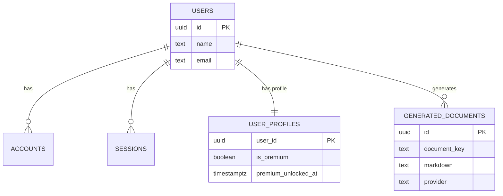
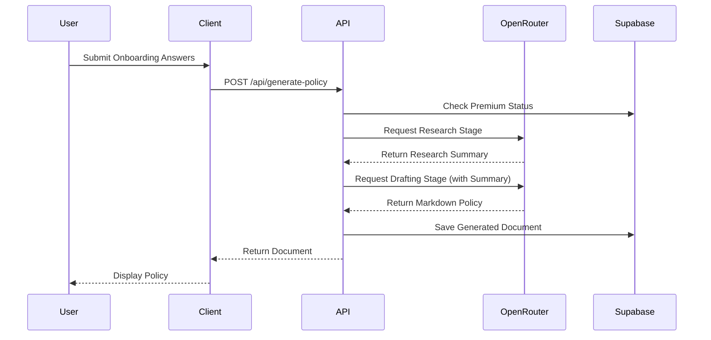

# تقرير التحليل الشامل لمشروع PolicyPack

## 1. نظرة عامة على المشروع (Project Overview)
**PolicyPack** هو تطبيق ويب متطور مبني باستخدام إطار عمل **Next.js 16.2.2** (App Router)، يهدف إلى توليد مستندات قانونية (مثل سياسة الخصوصية، شروط الخدمة، سياسة ملفات تعريف الارتباط، وملحق GDPR) بشكل آلي ومخصص باستخدام نماذج الذكاء الاصطناعي (عبر OpenRouter مثل Claude و Gemini).
يدمج النظام خدمات المصادقة عبر **NextAuth v5 (Beta)** مع قاعدة بيانات **Supabase (PostgreSQL)**، ويدعم الدفع والاشتراكات عبر منصة **Paddle**.

## 2. بنية المجلدات والملفات الرئيسية (Project Structure)
تم تنظيم المشروع وفقاً لأفضل ممارسات Next.js App Router:
- **`src/app/`**: يحتوي على مسارات التطبيق الرئيسية (Pages & Layouts) بالإضافة إلى واجهات برمجة التطبيقات (API Routes) مثل `/api/auth` و `/api/generate-policy`.
- **`src/components/`**: يحتوي على المكونات القابلة لإعادة الاستخدام مقسمة حسب الميزات (مثل `auth`, `billing`, `dashboard`, `ui`, `sections`). تم استخدام مكتبة **Shadcn UI** و **Tailwind CSS v4**.
- **`src/lib/`**: يحتوي على النواة المنطقية للتطبيق (Core Logic) مثل `policy-engine.ts`، إعدادات الذكاء الاصطناعي `ai-config.ts`، وعمليات قاعدة البيانات `auth-data.ts`.
- **`supabase/schema.sql`**: يحتوي على المخطط الهيكلي لقاعدة البيانات وإنشاء الجداول.
- **ملفات الإعدادات**: `package.json`، `eslint.config.mjs`، `next.config.ts`.
*(ملاحظة: لا يوجد ملف `docker-compose.yml` مما يشير إلى عدم إعداد بيئة التطوير عبر حاويات Docker محلياً).*

## 3. التبعيات الخارجية والثغرات الأمنية (Dependencies & Security)
من خلال فحص `package.json` وتشغيل `npm audit`، تم تحديد الآتي:
- **التبعيات الأساسية**:
  - `next: 16.2.2` (نسخة تجريبية / Beta وتحتوي على تغييرات جذرية كما هو موضح في `AGENTS.md`).
  - `next-auth: ^5.0.0-beta.30` للمصادقة.
  - `@supabase/supabase-js` و `@auth/supabase-adapter` للتكامل مع قاعدة البيانات.
  - `@paddle/paddle-node-sdk` و `@paddle/paddle-js` لمعالجة عمليات الدفع.
- **الثغرات الأمنية (Vulnerabilities)**:
  - **عالية الخطورة (High)**: ثغرة في `next` (Denial of Service with Server Components). يُنصح بتحديث Next.js إلى النسخة `16.2.3` أو أحدث.
  - **متوسطة الخطورة (Moderate)**: ثغرة في `nodemailer` (SMTP command injection). تتطلب التحديث أو المراجعة لمنع حقن الأوامر.

## 4. الأهداف الوظيفية وغير الوظيفية (Goals & Requirements)
**الأهداف الوظيفية:**
1. **المصادقة (Authentication)**: تسجيل الدخول عبر البريد/كلمة المرور أو Google.
2. **الاستبيان (Onboarding)**: جمع بيانات المستخدم والشركة (الاسم، الموقع، البيانات المجمعة).
3. **توليد المستندات (Policy Generation)**: استخدام الذكاء الاصطناعي عبر مرحلتين (بحث + صياغة) لتوليد المستندات القانونية.
4. **لوحة التحكم (Dashboard)**: إدارة المستندات المولدة والاطلاع على حالة الامتثال (Compliance Health).
5. **نظام الاشتراكات (Billing)**: ترقية الحسابات عبر Paddle لدعم التوليد المتقدم للمستندات.

**الأهداف غير الوظيفية:**
- **الأداء**: استخدام Server Components و Server Actions في Next.js لتقليل حجم حزمة جافا سكريبت على العميل.
- **الأمان**: تشفير كلمات المرور باستخدام `bcryptjs`.
- **المرونة**: القدرة على تبديل مزودي الذكاء الاصطناعي بسهولة عبر `OpenRouter`.

## 5. تقييم جودة الكود (Code Quality)
- **معايير التسمية**: ممتازة، تتبع أسلوب Kebab-Case للملفات و PascalCase للمكونات.
- **التحليل الثابت (Linting)**: الكود يجتاز فحوصات `ESLint` المدمجة بنجاح دون أخطاء.
- **تغطية الاختبار (Test Coverage)**: **0%**. يفتقر المشروع إلى أي اختبارات وحدوية (Unit Tests) أو اختبارات تكاملية (Integration/E2E Tests) مثل Jest أو Cypress، وهذا يشكل خطراً كبيراً في تطبيق يتعامل مع مستندات قانونية ومدفوعات.

## 6. المشكلات والتحديات التقنية (Technical Challenges & Risks)
1. **أمان قاعدة البيانات (Supabase RLS)**:
   ملف `supabase/schema.sql` يقوم بإنشاء جداول `user_profiles` و `generated_documents` دون تفعيل سياسات الأمان على مستوى الصفوف (Row Level Security - RLS). على الرغم من أن التطبيق يعتمد على Server-Side API، إلا أن تسريب `NEXT_PUBLIC_SUPABASE_ANON_KEY` قد يتيح لأي شخص الوصول وقراءة/تعديل البيانات.
2. **بيئة التطوير (Dev Environment)**:
   غياب ملف `.env.example` أو إعدادات Docker يجعل من الصعب على المطورين الجدد إعداد بيئة التطوير محلياً بسهولة.
3. **نسخة Next.js**:
   استخدام إصدار 16.2.2 (والذي يحمل تحذيراً صريحاً في `AGENTS.md` بوجود تغييرات كاسرة) قد يؤدي إلى مشاكل في التوافقية أو استقرار النظام.
4. **الثغرات الأمنية في المكتبات**:
   وجود ثغرات في `next` و `nodemailer` تتطلب معالجة فورية.

## 7. الرسوم التوضيحية والهيكل (Diagrams)

### مخطط علاقات الكيانات (ER Diagram - Supabase)

### مخطط تسلسل توليد المستندات (Sequence Diagram)

---

## 8. التوصيات والإجراءات المقترحة (Recommendations)
| الأولوية | الإجراء | الجهد التقديري |
|:---:|:---|:---|
| **عالية** | **تحديث الحزم الأمنية**: تشغيل `npm audit fix --force` وتحديث Next.js لتجنب ثغرة DoS. | منخفض (1-2 ساعات) |
| **عالية** | **تأمين قاعدة البيانات**: تفعيل RLS في `supabase/schema.sql` لمنع الوصول غير المصرح به عبر `anon_key`. | متوسط (3-4 ساعات) |
| **متوسطة** | **إضافة الاختبارات**: إعداد `Vitest` أو `Jest` وإضافة اختبارات للخدمات الأساسية (توليد المستندات والمصادقة). | مرتفع (أيام/أسابيع) |
| **متوسطة** | **توثيق بيئة التطوير**: إضافة ملف `.env.example` و `docker-compose.yml` (إذا لزم الأمر لقاعدة البيانات المحلية). | منخفض (ساعة) |
| **منخفضة** | **المراجعة المستمرة**: مراجعة التغييرات الكاسرة في Next.js (المذكورة في `AGENTS.md`) لضمان عدم تعطل واجهات API. | مستمر |