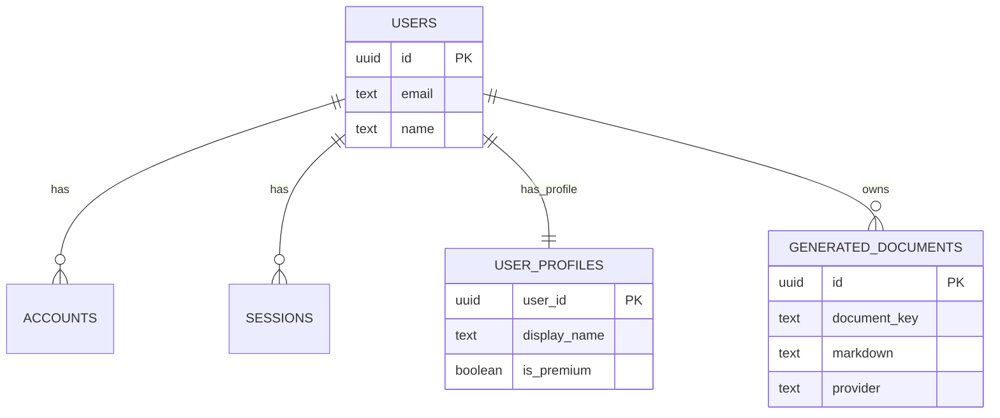
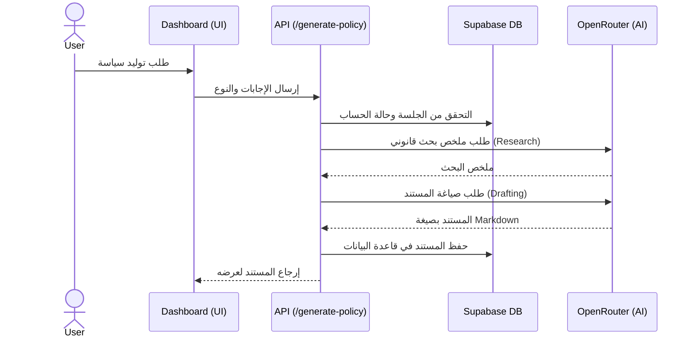

# التقرير الشامل لتحليل مشروع PolicyPack

تاريخ التحليل: 2026-04-11

## 1. مراجعة بنية المجلدات والملفات الرئيسية
المشروع مبني باستخدام إطار عمل **Next.js 16** (معمارية App Router) ولغة **TypeScript**.

### الهيكلة العامة:
- **`src/app/`**: يحتوي على مسارات التطبيق (الصفحة الرئيسية، Dashboard، Onboarding، الصفحات القانونية) ومسارات واجهة برمجة التطبيقات `api/` (للمصادقة، الدفع، وتوليد السياسات).
- **`src/components/`**: مكونات واجهة المستخدم مقسمة وظيفياً (Auth، Dashboard، UI base، Onboarding).
- **`src/lib/`**: يحتوي على منطق الأعمال الأساسي (Business Logic) مثل إعدادات قاعدة البيانات `db.ts`، محرك السياسات `policy-engine.ts`، وربط الذكاء الاصطناعي `ai-config.ts` و `policy-generator.ts`، والتعامل مع المدفوعات `paddle.ts`.
- **`supabase/schema.sql`**: مخطط قاعدة البيانات لتهيئة جداول المستخدمين والمستندات في بيئة PostgreSQL.
- **`docker-compose.yml`**: لتهيئة بيئة تطوير محلية لقاعدة بيانات Postgres.
- **`package.json`**: يحتوي على التبعيات وأوامر التشغيل الرئيسية.
- **`README.md`**: لا يزال يحتوي على القالب الافتراضي لـ Next.js ويحتاج إلى تحديث ليعكس طبيعة المشروع.

---

## 2. فحص الكود المصدري

### الواجهة الأمامية (Frontend)
- **التقنيات**: React 19، Tailwind CSS v4، Framer Motion، ومكونات Shadcn/Base-UI.
- **التصميم**: يعتمد على مكونات قابلة لإعادة الاستخدام (`UI` folder)، مع تجربة مستخدم ديناميكية تعتمد على حالة الجلسة (Onboarding Wizard).
- **الملاحظات**: مكون `compliance-dashboard.tsx` ضخم نسبياً ويدير العديد من الحالات (توليد المستندات، العرض، الدفع) مما قد يزيد من صعوبة صيانته مستقبلاً.

### الخلفية (Backend - API Routes)
- **المصادقة (`/api/auth`)**: تستخدم `NextAuth.js v5 beta` مع مزودات (Google و Credentials) ومحول `Supabase`.
- **توليد السياسات (`/api/generate-policy`)**: تعتمد على معمارية من مرحلتين (بحث قانوني وصياغة) باستخدام `OpenRouter` للاتصال بنماذج الذكاء الاصطناعي (مثل Claude 3.7 و Gemini 1.5).
- **الدفع (`/api/checkout/paddle`)**: مسارات مخصصة لإنشاء جلسات الدفع عبر Paddle واستقبال الـ Webhooks لتأكيد الدفع وفتح مزايا الـ Premium.

### قاعدة البيانات (Database)
- تعتمد على **PostgreSQL** المدارة عبر **Supabase**.
- المخطط (`schema.sql`) ينشئ جداول المصادقة (users, sessions, accounts) وجداول التطبيق الأساسية (`user_profiles`, `generated_documents`).
- **أمان البيانات**: تم تفعيل Row Level Security (RLS) لمنع الوصول غير المصرح به من الواجهة الأمامية مباشرة.

### الاختبارات (Tests)
- الإطار المستخدم: **Vitest** و **React Testing Library**.
- توجد اختبارات لوحدات محددة (`policy-engine.test.ts`, `auth-env.test.ts`)، وإجمالي الاختبارات المكتوبة هو 7 اختبارات وتمر بنجاح تام.
- **تغطية الاختبارات (Coverage)**: غير مكتملة بسبب نقص حزمة `@vitest/coverage-v8`.

---

## 3. التبعيات الخارجية والثغرات الأمنية

### أهم التبعيات:
- `next` (^16.2.3), `react` (19.2.4)
- `next-auth` (^5.0.0-beta.30)
- `@supabase/supabase-js` (^2.103.0)
- `@paddle/paddle-node-sdk` (^3.6.1)
- `nodemailer` (^7.0.5)

### الفحص الأمني (`npm audit`):
تم رصد **4 ثغرات** (1 متوسطة، 3 منخفضة):
- **Nodemailer**: توجد ثغرة حقن أوامر (SMTP Command Injection) في الإصدار الحالي. تؤثر هذه الثغرة أيضاً على `@auth/core` و `next-auth` بشكل غير مباشر. يُنصح بالحد من استخدام مدخلات المستخدمين غير المنقحة في إعدادات البريد، أو التحديث عند توفر إصدار آمن تماماً.

---

## 4. الأهداف الوظيفية وغير الوظيفية

### الأهداف الوظيفية:
1. السماح للمستخدمين بالتسجيل وتسجيل الدخول (عبر البريد/كلمة المرور أو Google OAuth).
2. جمع متطلبات سياسات المستخدم من خلال معالج (Onboarding Wizard).
3. توليد مستندات قانونية (سياسة خصوصية، شروط خدمة، الخ) مخصصة باستخدام الذكاء الاصطناعي بناءً على إجابات المستخدم.
4. تخزين المستندات المولدة في حساب المستخدم للوصول إليها لاحقاً.
5. توفير خطط مدفوعة (Premium) يتم إدارتها عبر Paddle للسماح بتوليد مستندات إضافية أو ميزات متقدمة.

### الأهداف غير الوظيفية:
1. **الأمان**: تشفير كلمات المرور (bcrypt)، التحقق من صحة Webhooks، وتأمين مسارات API من الوصول غير المصرح به.
2. **الأداء**: استخدام بيئة Next.js App Router لتقديم صفحات سريعة مع تحسين محركات البحث.
3. **الاعتمادية**: توفير نظام بديل (Fallback Template) في حال فشل الاتصال بمزود الذكاء الاصطناعي.

---

## 5. تقييم جودة الكود

- **معايير التسمية**: ممتازة ومتسقة، أسماء المتغيرات والملفات واضحة وتعكس الغرض منها.
- **التنسيق والـ Linting**: تم تنفيذ `npm run lint` واجتاز الفحص **بدون أي أخطاء أو تحذيرات**.
- **النوعية (TypeScript)**: تم تنفيذ `npm run typecheck` واجتاز الفحص **بدون أي أخطاء**، مما يعكس صرامة وجودة عالية في تعريف الأنواع.
- **الاختبارات**: تمر بنجاح، لكن التغطية (Coverage) تعتبر محدودة وتقتصر على وحدات صغيرة، وتفتقر لاختبارات شاملة (E2E) لمسار الدفع أو التوليد المعقد.

---

## 6. المشكلات والتحديات التقنية

1. **ثغرة أمنية في التبعيات**: حزمة `nodemailer` تحتوي على ثغرات تؤثر على حزم المصادقة.
2. **غياب ملف إعداد البيئة**: لا يوجد ملف `.env.example` لتوضيح المتغيرات المطلوبة لتشغيل المشروع (مثل مفاتيح OpenRouter، Paddle، Supabase، وGoogle OAuth).
3. **تغطية الاختبارات**: عدم وجود حزمة `@vitest/coverage-v8` يمنع قياس تغطية الكود، كما أن عدد الاختبارات الحالي (7) قليل مقارنة بحجم المشروع.
4. **توثيق المشروع**: ملف `README.md` لا يعكس طبيعة المشروع ولا يوفر إرشادات التشغيل للمطورين الجدد.
5. **التعقيد في الواجهة الأمامية**: المكون `compliance-dashboard.tsx` يقوم بمهام كثيرة (إدارة حالة، استدعاء API، وتحديث واجهة) ويُفضل تقسيمه.

---

## 7. الرسوم التوضيحية

### مخطط الكيانات والعلاقات (ER Diagram)

### مخطط التسلسل (Sequence Diagram) لتوليد المستندات

